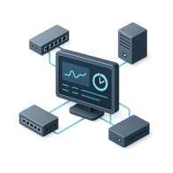

# 🌐 From Helpdesk to Network Engineer

> **A story event, not a course.**

From Helpdesk to Network Engineer is a **14-day interactive networking experience**. You start as an IT support technician who knows nothing about networking.

You'll experience the entire climb: resolving your first IT tickets, learning networking fundamentals, passing your CCNA, moving into the NOC, and eventually earning the **Network Engineer** title.



## 📅 One Episode Per Day

A new episode unlocks every day. Each episode includes:

- 📖 **A chapter of the story**
- 🧠 **One core networking concept explained**
- 🛠️ **A guided exercise** (20–30 minutes)

Missed a day? No problem. Episodes stay unlocked, so you can catch up whenever you want.

## 📈 Progressive Difficulty

### Days 1–7: Networking Essentials

Master the fundamentals every helpdesk technician should know.

- Networking basics
- IP addressing
- Subnetting
- VLANs
- Switching
- Routing fundamentals
- Basic troubleshooting

### Days 8–14: Real-World Networking

Dive into **CCNA and ENCOR-style troubleshooting scenarios**, broken down step by step.

- Network troubleshooting
- Routing protocols
- OSPF
- ACLs
- HSRP
- Network redundancy
- Real-world failure scenarios

## 🎯 Goal

By the end of the 14-day experience, you'll have progressed from:

```text
IT Support Technician
        ↓
Networking Fundamentals
        ↓
CCNA-Level Skills
        ↓
NOC Technician
        ↓
Network Engineer
